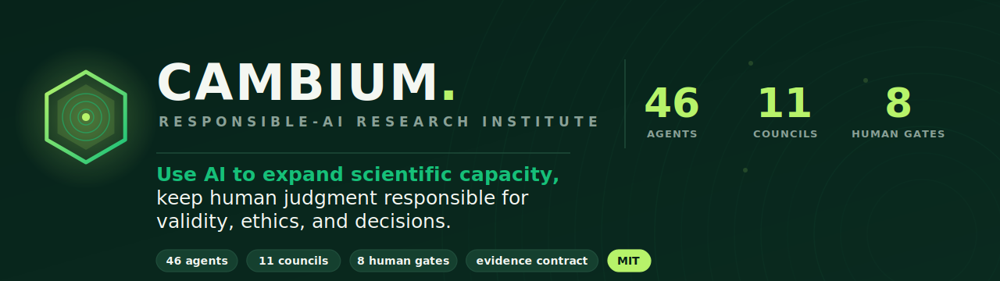
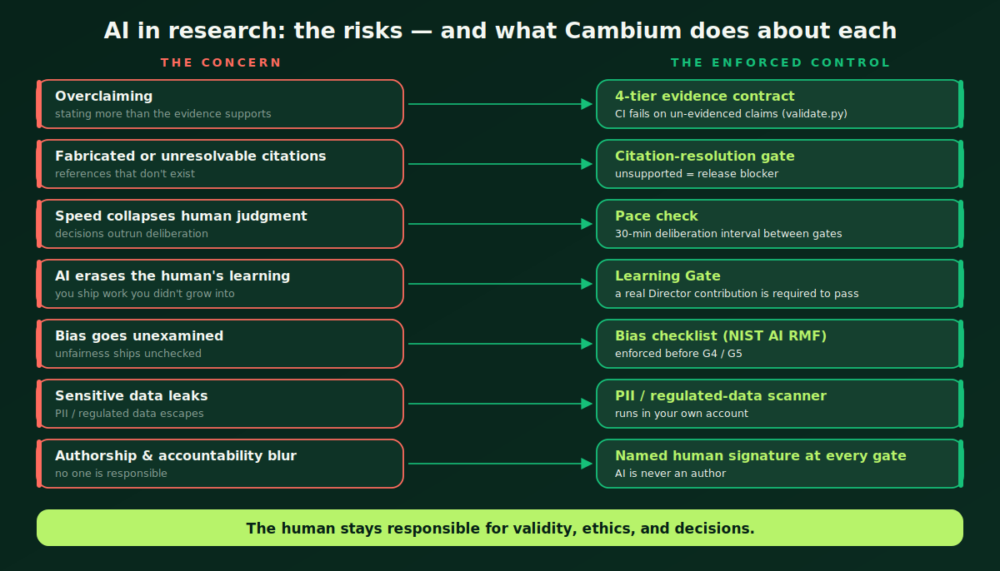
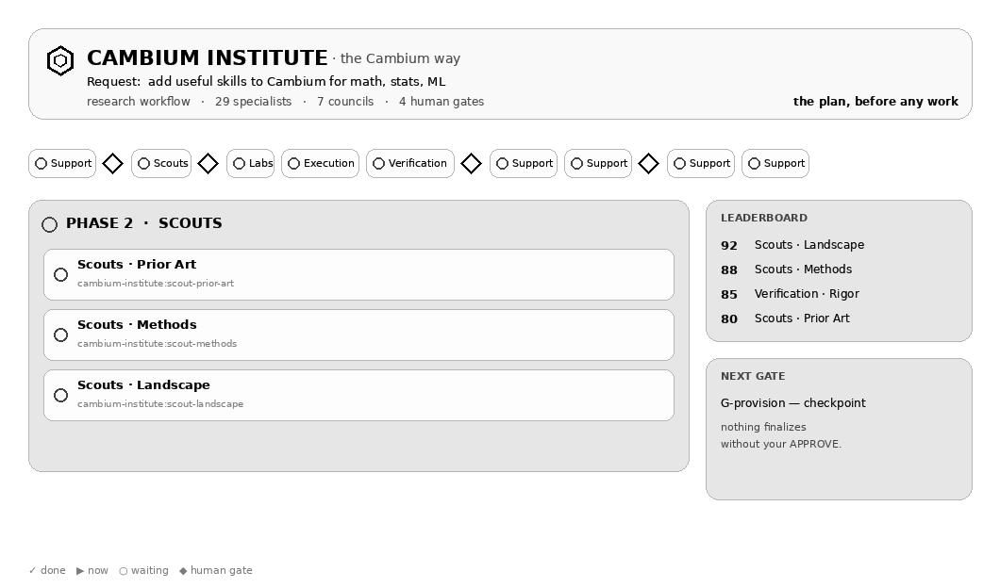
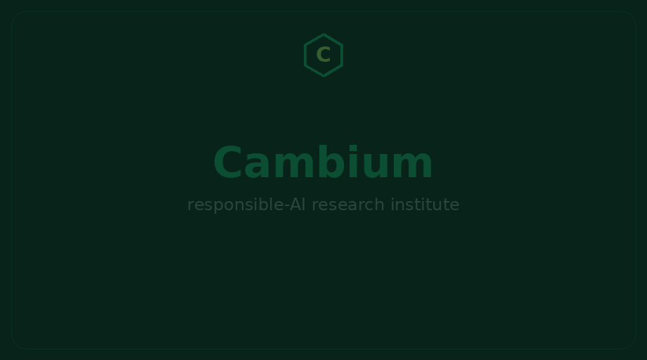
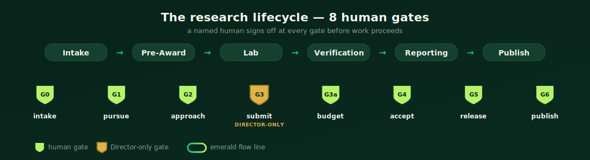
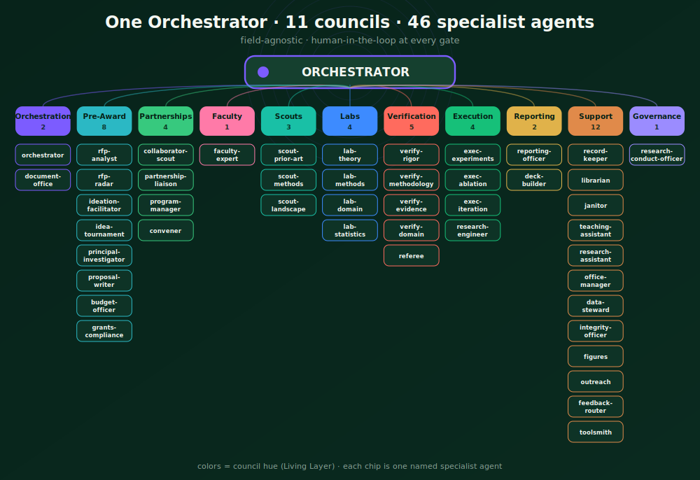

<div align="center">



<br>

<a href="https://github.com/IFC-UIDAHO/Cambium_AI/actions"></a>
<a href="CHANGELOG.md"></a>


<h3>The institute that lets AI do the work — and keeps a human responsible for the science.</h3>

<em>Cambium turns one researcher into a whole institute of named AI specialists —<br>
then stops at human gates so a person, not a model, owns every decision that matters.</em>

</div>

---

## Why Cambium exists

AI can read a thousand papers, draft a proposal, and run an analysis before lunch. It can also **overclaim**, **invent citations**, **outrun your judgment**, and quietly **author the science it was only meant to assist** — and in research, those failures don't just cost time, they corrupt the record.

Most tools answer this with a policy page. Cambium answers it with **mechanism**. Every concern people raise about AI in research is wired to a control that actually fires — in CI, at a gate, before anything ships.

<div align="center">

</div>

> **Cambium's one rule:** *use AI to expand scientific capacity, but keep human judgment responsible for validity, ethics, and decisions.* Where a control is fully enforced we say so; where it's enabled but not yet guaranteed we mark it **partial** — because overclaiming is the exact failure this project exists to prevent. See [`VISION.md`](VISION.md) and the 10-point [`AI_POLICY.md`](AI_POLICY.md).

---

## What it is, in 10 seconds

Cambium is a **human-led research institute** you run from your own machine. One request becomes an **Orchestrator** that convenes the **11 councils** and **46 named specialist agents** the task actually needs — scouts, labs, a verification board, reporting, governance — and drives them from RFP to verified result. At **8 human gates**, it stops and hands you the decision. Nothing is submitted, released, or published without your signature.

It's a Claude Code / Cowork **plugin** plus an **MCP server** — field-agnostic, MIT-licensed, no third-party cloud.

---

## See it work

A real run advances in chat — named agents wake, work, and report, then the run **stops at a gate for you**:

<div align="center">

</div>

<div align="center">

</div>

---

## 60-second quickstart

```bash
# 1) Add the marketplace + install the plugin (Claude Code / Cowork)
/plugin marketplace add IFC-UIDAHO/Cambium_AI
/plugin install cambium-institute

# 2) Taste it with zero setup — a full plan, no API key, no calls
/cambium run example

# 3) Run your own task, the Cambium way
/cambium draft an NSF proposal on soil-carbon monitoring in dryland systems
```

That's it. `/cambium` paints a **live run board** of the institute working, dispatches the real named agents, and pauses at each gate with a clickable **Approve / Revise / Reject** card. Prefer plain speed? `/cambium-mode` drops any task to **solo** (no councils, no gates).

---

## How to use it — what to say

| You want to… | Say |
|---|---|
| See the whole institute run a task | `/cambium <your task>` |
| Try it with zero setup | `/cambium run example` |
| Read a funding call & decide fit | `/cambium read this RFP: <link or text>` |
| Turn approved aims into a proposal | `/cambium draft the proposal` |
| Build & verify a method | `/cambium run the lab` |
| Adversarially check a result or claim | `/cambium verify this: <result>` |
| Write a progress / annual report | `/cambium write the quarterly report` |
| Go fast, no gates | `/cambium-mode` → solo |


---

## The lifecycle & 8 human gates

Cambium covers the whole arc of a research project — and puts a human checkpoint at every place a decision actually matters. Gates aren't speed bumps; they're where accountability lives.

<div align="center">

</div>

| Gate | Where | The decision you own |
|---|---|---|
| **G0** | Intake | Is this worth the institute's time? |
| **G1** | Pre-award | Pursue this direction / RFP? |
| **G2** | Design | Which approach advances? |
| **G3** | Submit | Finalize & submit — **Director-only**, no AI self-certify |
| **G3a** | Budget | Budget & compliance sign-off |
| **G4** | Results | Accept the results (after every number is reproduced) |
| **G5** | Report | Release the report? |
| **G6** | Publish | Publish / go public? |

At each gate the run **stops**, shows a one-page summary, and waits. A bare "looks good" doesn't pass: the **Learning Gate** requires a real contribution from you, and consecutive decisions are spaced by a **deliberation interval** so speed can't quietly replace judgment.

---

## The architecture

One Orchestrator. Eleven councils. Forty-six specialists who each do one thing well — and never grade their own work (the Verification board is independent, and authorship is never the approver).

<div align="center">

</div>

**The councils:** Orchestration · Pre-Award · Partnerships · Faculty · Scouts · Labs · **Verification** · Execution · Reporting · Support · **Governance**. The Orchestrator decomposes your goal, dispatches only the councils the task needs (in parallel where it can), merges their work into one ranked decision, keeps the findings ledger, and runs the gates. You always see *which named agent is working, on what.*

---

## Responsible AI, by construction

Cambium's honesty isn't a tone — it's a **type system for claims**. Every factual statement an agent makes carries an explicit tier, and CI ([`governance/validate.py`](governance/validate.py)) **fails the build** if a claim outruns its evidence.

| Tier | Means | Example |
|---|---|---|
| **Proved** | a theorem / formal proof | "the estimator is unbiased under A1–A3" |
| **Code-verified** | a script ran and reproduced the number | "FCR = 0.33 (12/36), rerun-hash recorded" |
| **Asserted** | claimed, not yet verified | "this approach should generalize" |
| **Open** | unknown / unresolved | "whether enforcement beats prompting — Open" |

On top of the contract sit the controls in the diagram above — a **citation-resolution gate** (an unsupported citation is a release *blocker*), a **PII/regulated-data scanner**, a **bias checklist** (NIST AI RMF) required before results gates, a **pace check**, a hash-chained **audit trail**, and a **named human signature** recorded for every gate in [`governance/GATES.md`](governance/GATES.md).

**We grade ourselves the same way we grade everyone else.** An integrity-audited scorecard against the field's top-10 concerns currently reads **3 Leads · 6 Partial · 1 Gap** — and we publish the Partials and the Gap rather than rounding them up. The enforcement A/B study we pre-registered and ran reports an honest **Open** (no measured effect yet on a near-ceiling model) — we ship the harness and the null, not spin. See [`POSITIONING.md`](POSITIONING.md), [`evals/enforcement_study/`](evals/enforcement_study/), and the live [evaluation dashboard](assets/benchmark_dashboard.html).

---

## What's inside

**23 skills · 41 tools · 6 MCP tools · 15 templates · worked examples** — field-agnostic, all runnable.

- **Skills** — the verbs: `/cambium`, `rfp-intake`, `proposal`, `run-lab`, `verification`, `reporting`, `budget`, `statistics`, `citations`, `data-management`, `reproducibility`, `research-ethics`, and more. New domain expertise is grown on demand by the skill-provisioner.
- **Tools** — the machinery (terminal or MCP): the run board (`gen_inline_board.py`, `gen_board_pro.py`), the gate interlock (`gate.py`, `gate_lock.py`), the evidence validator, `pace_check.py`, `data_scan.py`, the enforcement gauntlet (`enforce.py`), the self-grading `doctor.py`, and the A/B study harness.
- **MCP server** — drive the institute from any MCP-capable client.
- **Governance** — `VISION.md`, `AI_POLICY.md`, `POSITIONING.md`, the gates ledger, and per-funder rule packs (NSF, NIH, USDA-AFRI, DOE).

---

## How it compares

| | AI research assistants | Agent frameworks | **Cambium** |
|---|:--:|:--:|:--:|
| Named, specialized roles | — | partial | **46 across 11 councils** |
| Human gates that *block* | — | — | **8, signed** |
| Claims typed & CI-enforced | — | — | **4-tier evidence contract** |
| Citation / data / bias controls | partial | — | **enforced at the gate** |
| Reproduces its own numbers | — | — | **Verification board** |
| Runs in *your* account, MIT | partial | partial | **yes** |
| Honest about what it *can't* do | rare | rare | **publishes its Partials & null** |

Cambium isn't trying to be a faster assistant. It's trying to be the part of the lab that keeps the science honest while the AI does the volume.

---

## Built for teams

Multi-PI projects get **named, institution-scoped approvers** — a gate won't pass unless the *right* Co-PI signs ([`templates/MULTI_PI_ROLES.yml`](templates/MULTI_PI_ROLES.yml)) — plus a model router that sends heavy reasoning to the strongest model and routine work to a cheaper one. Federated shared infrastructure (SSO/RBAC across institutions) is the honest open gap, staged in [`ROADMAP.md`](ROADMAP.md).

---

## Roadmap

Near-term: **execute the v1 enforcement A/B** (powered, human-judged — the harness, task set, and rater UI are built and waiting); deepen reproducibility. Longer-term: **shared multi-institution infrastructure** for consortium grants, and a **cinematic web front-end** that drives the same gated engine. Nothing ships to this list without the same evidence contract applied to it.

---

## Cite & license

MIT © the Cambium contributors / University of Idaho IFC. If Cambium supports your work, please cite the repository. Built on Claude Code and the Claude Agent SDK; Cambium is not affiliated with or endorsed by Anthropic.

<div align="center"><br><em>⬢ Cambium — research that grows, responsibly.</em></div>
