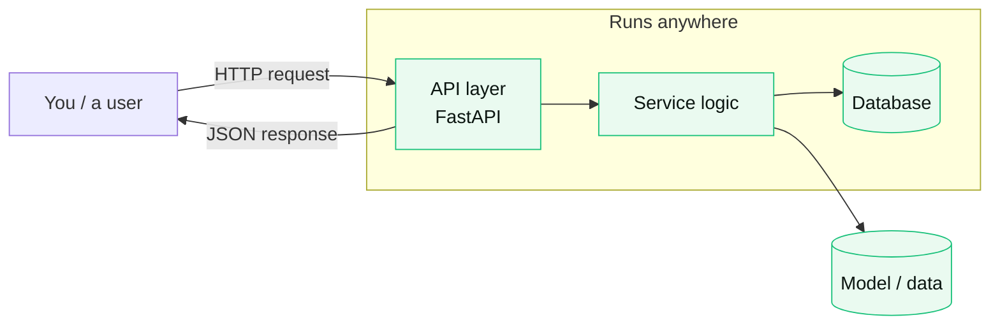

# Learning brief

> The teaching-assistant fills this in at the **learn** step, after a build or analysis. The goal is not to
> document the code, it is to help the Director actually understand and own what was made. Plain language,
> no jargon walls. The Director can ask follow-ups on any line.

## What we built, in one breath
<One or two plain sentences. Example: "We built a small web service that takes a request, runs your model,
and returns a prediction, packaged so it runs the same on any machine.">

## How it fits together
A picture of the moving parts and how they connect. Keep it to the pieces that matter.

<Replace this with the real components of THIS build: the language, the framework, the data store, Docker,
the API, whatever is actually there. One node per real piece.>

## The decisions, and why
| Choice | Why this one | What we gave up |
|---|---|---|
| <e.g. FastAPI> | <fast to write, typed, good docs> | <less mature than Flask in some plugins> |
| <e.g. Postgres> | <reliable, you may already run it> | <heavier than SQLite for a tiny app> |

## What to understand to own this
The three to five ideas that, once they click, let you change this yourself:
1. <e.g. what an API endpoint is and how a request flows through it>
2. <e.g. what Docker does and why "runs anywhere" matters>
3. <e.g. where the model is loaded and how to swap it>

## Try it yourself (optional)
One small, safe change you could make to learn by doing. Example: "Add a `/health` endpoint that returns
ok, and watch how the request flows through the same path as the diagram above."

## Ask me anything
Reply with a question and the teaching-assistant will explain at your level. For example: "explain the
Docker part," "why this database," or "walk me through what happens when I hit the API."

---
*This brief is the learning-by-doing layer of the Learning Gate. The point of Cambium is that AI does the
volume while you stay the one who understands and decides.*
